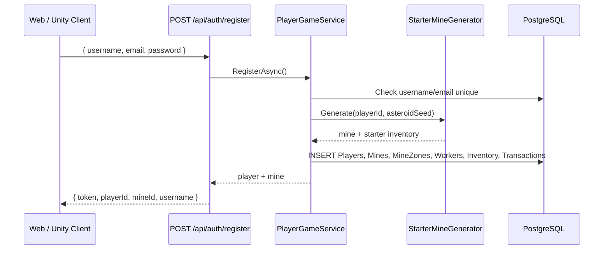

# Create Account → Database Flow

How a new Rava account is created from the client through the API and into PostgreSQL.

## Overview

Registration is a single API call that atomically creates:

- 1 **player** row
- 1 **starter mine** with 64 zones and 5 workers
- 4 **inventory** rows (starter supplies)
- 1 **transaction** row (starter credits grant)

The client receives a JWT and can play immediately — no separate “create mine” step.



## Client entry points

### Web app (`www/js/app.js`)

1. User switches to **Register** mode and fills username, email, password.
2. `POST /api/auth/register` with JSON body.
3. JWT + `mineId` saved to `localStorage`.
4. Game UI loads mine, finances, and market.

### Unity client (`LoginPanel` → `GameSession.RegisterAsync`)

Same API call via `ApiClient.RegisterAsync`. Token stored in memory on `ApiClient`.

## API endpoint

| | |
|---|---|
| **Method** | `POST` |
| **Route** | `/api/auth/register` |
| **Auth** | None (anonymous) |

### Request body

```json
{
  "username": "commander42",
  "email": "commander@example.com",
  "password": "your-secure-password"
}
```

### Success response (`200 OK`)

```json
{
  "token": "<jwt>",
  "playerId": "<guid>",
  "mineId": "<guid>",
  "username": "commander42",
  "features": {
    "trading": false,
    "friends": false,
    "multiMine": false,
    "mineGroups": false,
    "specialDeals": false,
    "accountNuke": false
  }
}
```

### Error responses

| Status | Reason |
|--------|--------|
| `400 Bad Request` | Username or email already exists |
| `400 Bad Request` | Validation failure (missing fields) |

## Server logic

**Controller:** `AuthController.Register`  
**Service:** `PlayerGameService.RegisterAsync`

### Step-by-step

1. **Uniqueness check** — query `Players` for matching `Username` or `Email`. If found, return `"Username or email already exists."`

2. **Generate IDs** — new `playerId` (Guid), random `asteroidSeed` (1000–999999).

3. **Starter mine generation** (`StarterMineGenerator.Generate`):
   - Mine name: `"Starter Claim Alpha"`
   - **8×8 grid** (64 zones) — ore types seeded by `asteroidSeed`
   - Zone `(0,0)` is always a **salvage zone** (`SalvageScrap`)
   - **5 workers** with fixed names, random skill 1–3, salaries 80–140 cr/day
   - **4 supply stacks** × 10 units each (DrillBits, FuelCells, LifeSupport, CommModules)

4. **Build player entity**:
   - Password hashed with **BCrypt** (`BcryptPasswordHasher`)
   - Starting credits: **5000** (`GameBalance.StarterCredits`)
   - `CurrentGameDay`: **1**

5. **Starter transaction** — one `Transactions` row logging the 5000 cr grant.

6. **Persist** — single `SaveChangesAsync`:
   ```csharp
   db.Players.Add(player);
   db.Mines.Add(mine);           // cascades zones + workers
   db.Inventory.AddRange(inventoryEntities);
   await db.SaveChangesAsync(ct);
   ```

7. **Issue JWT** — 7-day token with claims `sub`, `unique_name`, `playerId`.

## Database tables written

All tables live in the `rava` database (PostgreSQL). Schema is created on first API startup via EF Core `EnsureCreated`.

### `Players` (1 row)

| Column | Example value |
|--------|----------------|
| `Id` | new Guid |
| `Username` | from request |
| `Email` | from request |
| `PasswordHash` | BCrypt hash (never plain text) |
| `Credits` | `5000` |
| `CurrentGameDay` | `1` |
| `CreatedAt` | UTC now |

Unique indexes: `Username`, `Email`.

### `Mines` (1 row)

| Column | Example value |
|--------|----------------|
| `Id` | new Guid |
| `PlayerId` | FK → `Players.Id` |
| `Name` | `Starter Claim Alpha` |
| `AsteroidSeed` | random int |
| `Status` | `Active` |
| `PurchasedAt` | UTC now |

### `MineZones` (64 rows)

One row per grid cell `(x, y)` where `0 ≤ x,y < 8`.

| Column | Notes |
|--------|--------|
| `OreType` | Ferroxite / Voidium / Stellarite (random), or SalvageScrap at (0,0) |
| `Richness` | 0.35 (salvage) or 0.5–1.0 |
| `DepletedPct` | `0` |
| `IsSalvageZone` | `true` only at (0,0) |

### `Workers` (5 rows)

| Name | Salary pattern |
|------|----------------|
| Axel Voss, Mira Chen, Dax Okonkwo, Lena Frost, Rook Vega | 80, 95, 110, 125, 140 cr/day |

All start **unassigned** (`AssignedZoneId` = null).

### `Inventory` (4 rows)

| ItemType | Category | Quantity |
|----------|----------|----------|
| DrillBits | Supply | 10 |
| FuelCells | Supply | 10 |
| LifeSupport | Supply | 10 |
| CommModules | Supply | 10 |

### `Transactions` (1 row)

| Type | Amount | Description |
|------|--------|-------------|
| `StarterGrant` | +5000 | `Starter credits grant` |

## Manual test with curl

```bash
curl -X POST http://localhost:5000/api/auth/register \
  -H "Content-Type: application/json" \
  -d "{\"username\":\"testuser\",\"email\":\"test@example.com\",\"password\":\"Test1234!\"}"
```

Verify in PostgreSQL:

```sql
SELECT "Id", "Username", "Email", "Credits" FROM "Players" WHERE "Username" = 'testuser';

SELECT COUNT(*) FROM "MineZones" z
JOIN "Mines" m ON m."Id" = z."MineId"
JOIN "Players" p ON p."Id" = m."PlayerId"
WHERE p."Username" = 'testuser';
-- Expected: 64

SELECT COUNT(*) FROM "Workers" w
JOIN "Mines" m ON m."Id" = w."MineId"
JOIN "Players" p ON p."Id" = m."PlayerId"
WHERE p."Username" = 'testuser';
-- Expected: 5
```

## Configuration

Connection string: `appsettings.Development.json` → `ConnectionStrings:DefaultConnection`

Example (remote Postgres):

```
Host=192.168.1.2;Port=5432;Database=rava;Username=postgres;Password=...
```

## Related code

| File | Role |
|------|------|
| `server/Rava.Api/Controllers/AuthController.cs` | HTTP endpoint |
| `server/Rava.Infrastructure/Services/PlayerGameService.cs` | Registration orchestration |
| `server/Rava.Core/Services/StarterMineGenerator.cs` | Mine + inventory generation |
| `server/Rava.Core/Services/BcryptPasswordHasher.cs` | Password hashing |
| `server/Rava.Core/Constants/GameBalance.cs` | Starter credits, grid size, supply qty |
| `server/Rava.Infrastructure/Entities/Entities.cs` | EF entity definitions |
| `server/Rava.Api/www/js/app.js` | Web client registration UI |
